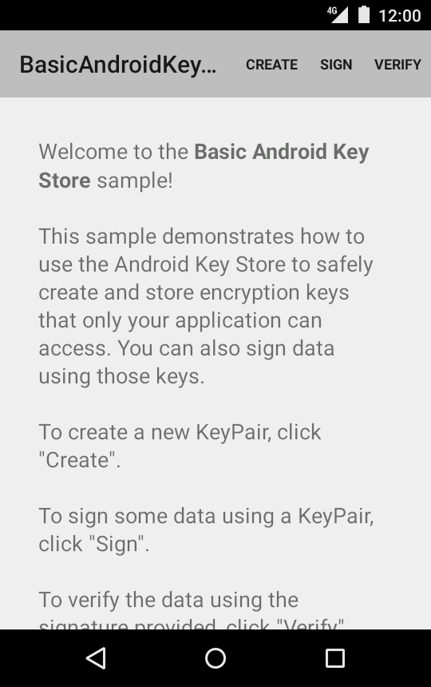
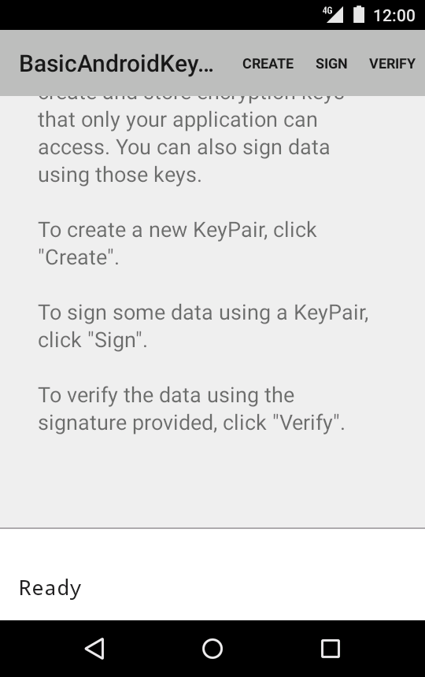
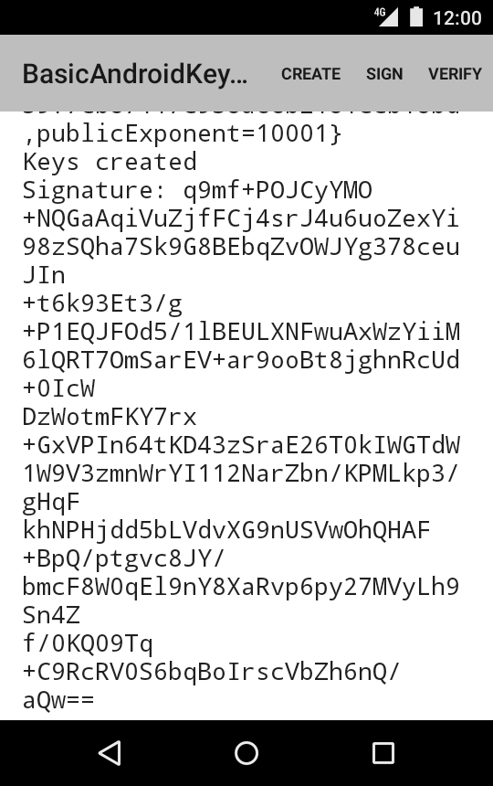
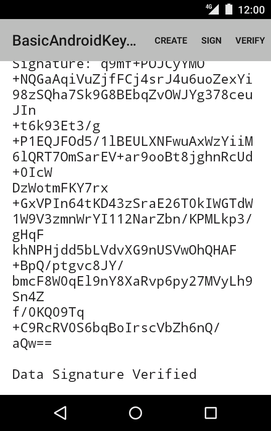

Android BasicAndroidKeyStore Sample
===================================

An advanced sample displaying the creation and usage of data integrity mechanisms

Introduction
------------

This sample demonstrates how to use the Android [KeyStore][1] to safely create and store
encryption keys that only your application can access.

A [KeyPair][2] consisting of a [PrivateKey][3] and a [PublicKey][4] is being generated.
The private key then is being used to sign and verify a String.

Next to that appropriate exception handling for potential errors is being displayed.

[1]: https://developer.android.com/reference/java/security/KeyStore.html
[2]: https://developer.android.com/reference/java/security/KeyPair.html
[3]: https://developer.android.com/reference/java/security/PrivateKey.html
[4]: https://developer.android.com/reference/java/security/PublicKey.html

Pre-requisites
--------------

- Android SDK v23
- Android Build Tools v23.0.0
- Android Support Repository

Screenshots
-------------

     

Getting Started
---------------

This sample uses the Gradle build system. To build this project, use the
"gradlew build" command or use "Import Project" in Android Studio.

Support
-------

- Google+ Community: https://plus.google.com/communities/105153134372062985968
- Stack Overflow: http://stackoverflow.com/questions/tagged/android

If you've found an error in this sample, please file an issue:
https://github.com/googlesamples/android-BasicAndroidKeyStore

Patches are encouraged, and may be submitted by forking this project and
submitting a pull request through GitHub. Please see CONTRIBUTING.md for more details.

License
-------

Copyright 2014 The Android Open Source Project, Inc.

Licensed to the Apache Software Foundation (ASF) under one or more contributor
license agreements.  See the NOTICE file distributed with this work for
additional information regarding copyright ownership.  The ASF licenses this
file to you under the Apache License, Version 2.0 (the "License"); you may not
use this file except in compliance with the License.  You may obtain a copy of
the License at

http://www.apache.org/licenses/LICENSE-2.0

Unless required by applicable law or agreed to in writing, software
distributed under the License is distributed on an "AS IS" BASIS, WITHOUT
WARRANTIES OR CONDITIONS OF ANY KIND, either express or implied.  See the
License for the specific language governing permissions and limitations under
the License.
